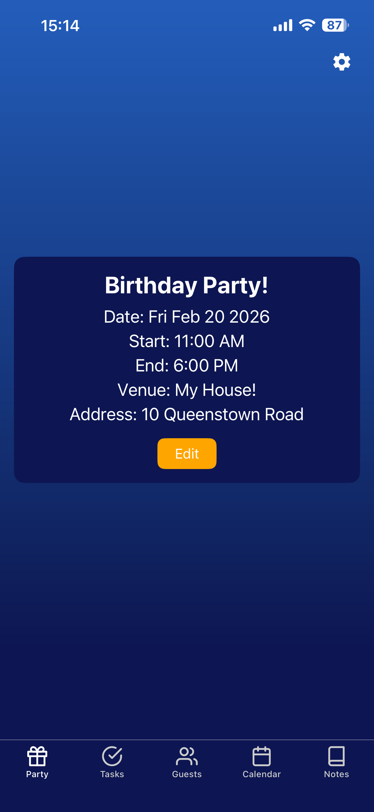
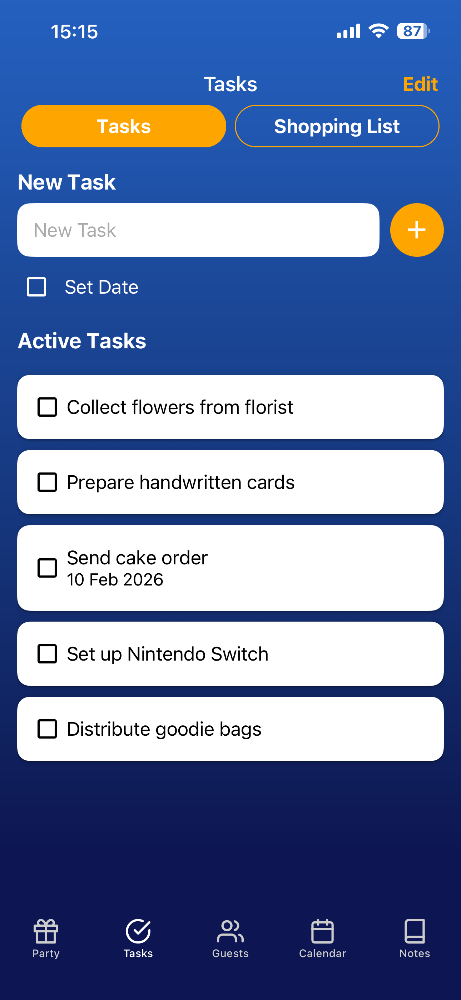
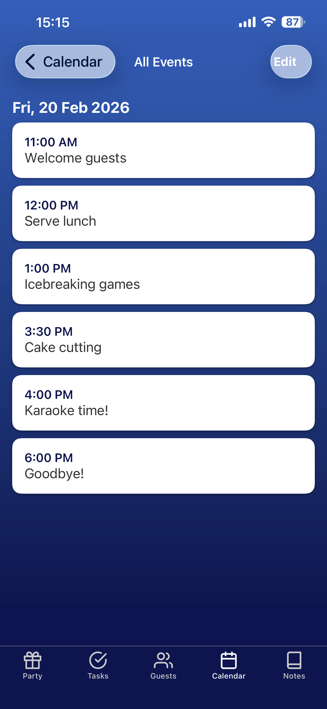

# MyPartyPlanner

MyPartyPlanner is a React Native app for planning an event/party in one place: party details, tasks, shopping list, guest list, invitations, calendar, and notes.

## App Store

**Download on the iOS App Store:**
https://apps.apple.com/sg/app/mypartyplanner/id6758308709

## Screenshots

<p align="center">
  
  
  
</p>


## Features

- **Party details**: name, date, start/end time, venue, and address (saved on-device).
- **Tasks**: create tasks, mark complete, reorder via drag-and-drop, and optionally add a due date.
- **Shopping list**: item + price + quantity, auto totals, check off items, and reorder/edit items.
- **Guests**: store guest contact info and dietary restrictions.
- **Invitations**: generate invitation text from templates, manage saved invitations, and send via the OS share sheet or WhatsApp.
- **Calendar**: view events and dated tasks on a calendar, add events, and browse events by day.
- **Notes**: quick notes saved on-device.
- **Reset**: “Reset App Data” clears local app data from the Party screen.

## Tech Stack

- React Native (`react-native`)
- React Navigation (`@react-navigation/*`)
- UI: React Native Paper (`react-native-paper`)
- Local persistence: AsyncStorage (`@react-native-async-storage/async-storage`)

## Getting Started (Local Development)

### Prerequisites

- Node.js (LTS recommended) + npm
- Xcode + CocoaPods (for iOS)
- Ruby (for CocoaPods via Bundler). macOS system Ruby (`/usr/bin/ruby`) is too old for this repo’s `Gemfile.lock`.
- Android Studio (for Android)

### Install

```bash
npm install
```

### iOS

```bash
# If `ruby -v` shows `/usr/bin/ruby`, switch to Homebrew Ruby first:
#   export PATH="/opt/homebrew/opt/ruby/bin:/opt/homebrew/lib/ruby/gems/4.0.0/bin:$PATH"

cd ios
bundle install
bundle exec pod install
cd ..
npm run ios
```

If you open the project in Xcode, open `ios/MyPartyPlanner.xcworkspace` (not `ios/MyPartyPlanner.xcodeproj`). Opening the `.xcodeproj` will often produce linker errors (e.g. Hermes undefined symbols / missing frameworks) because CocoaPods dependencies aren’t part of the project.

### Android

```bash
npm run android
```

### Tests

```bash
npm test
```

## Privacy Policy

**Effective date:** January 26, 2026

MyPartyPlanner is designed to work primarily offline and stores your data locally on your device.

### Information We Collect

We **do not collect** personal information from you through our servers, because the app does not use a backend service.

The information you enter (for example: party details, tasks, notes, events, invitations, and guest information such as names, phone numbers, emails, and dietary restrictions) is stored **locally on your device** using on-device storage.

We do not use analytics SDKs, advertising SDKs, or cross-app tracking in this app.

### How We Use Information

We use the information you enter only to provide the app’s features (show your party details, tasks, guests, invitations, calendar events, and notes).

### Sharing of Information

We do not sell or share your information with third parties from a server because we do not operate a server for this app.

However, you may choose to share invitation text externally:

- **Share Sheet:** If you tap “Send with Share Menu”, the invitation text is passed to the iOS/Android share sheet, and then to the app/service you choose (e.g., Messages, Mail).
- **WhatsApp:** If you tap “Send to Guest via WhatsApp”, the app will open WhatsApp (if installed) with your selected guest phone number and invitation text. WhatsApp’s handling of that data is governed by WhatsApp/Meta’s privacy policy.

### Notifications

On iOS, the app may request permission to show notifications. If you grant permission, notifications (if used) are handled by your device’s operating system. We do not receive notification data.

### Data Retention and Deletion

Your data remains on your device until you delete it. You can clear local app data by using **Reset App Data** in the Party screen, or by uninstalling the app.

### Contact Access

The app does not request access to your system contacts. Guest details are only the information you manually enter into the app.

### Children’s Privacy

MyPartyPlanner is not directed to children under 13, and we do not knowingly collect personal information from children.

### Changes to This Policy

We may update this policy from time to time. Updates will be reflected in this document with a new effective date.

### Contact

If you have questions about this policy, contact the developer via the contact information listed on the app’s store listing or the GitHub repository.

---

This privacy policy is also available in `PRIVACY_POLICY.md`.
